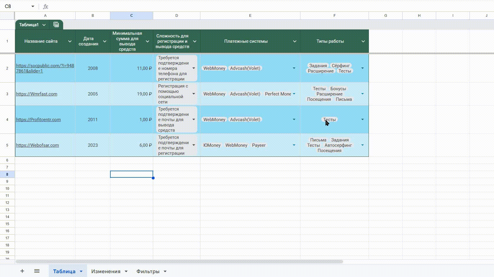

# Мониторинг сайтов с помощью Google Таблиц

Универсальное веб-приложение для мониторинга информации о любых сайтах и сервисов. Загружает данные из Google Sheets, отображает в таблице с фильтрами и отслеживает все изменения в реальном времени.

**Пример использования**: буксы (сайты микротасков), но подходит для любых платформ — сервисы заработка, маркетплейсы, финансовые инструменты, интернет-магазины и т.д.

## 💰 Полностью бесплатно!

- ✅ Google Sheets - бесплатное хранилище данных
- ✅ Статический веб-сайт - можно разместить на GitHub Pages, Netlify, Vercel
- ✅ Открытый исходный код для модификации
- ✅ Никаких платежей и подписок

## 🎯 Основные возможности



- 📊 Таблица сравнения с фильтрацией по платежным системам и типам работ
- 📈 История изменений (последние 5 на главной, все на отдельной странице)
- 🔗 Фавиконы платежных систем
- 📱 Адаптивный дизайн (таблица + карточки на мобильных)
- ⚡ Работает как статический сайт (без сервера!)

## 🛠 Технология

- **Frontend**: HTML5, CSS3, JavaScript
- **Backend**: Python (опционально - для ускорения API)
- **Загрузка данных**: CSV из Google Sheets (основной способ) или Google Sheets API
- **Хранилище**: Google Sheets

## 📂 Структура проекта

```
.
├── index.html              # Главная страница
├── all-changes.html        # Страница со всеми изменениями
├── server.py               # Python сервер (опционально)
├── .env.example            # Шаблон для Google Sheets API ключа
├── Code.gs                 # Google Apps Script (триггер)
├── appsscript.json         # Конфигурация скрипта
└── README.md               # Этот файл
```

## 🔗 Google Sheets структура

| Лист | Назначение |
|------|-----------|
| Таблица (1897875028) | Основные данные о сайтах |
| Изменения (1531258534) | История всех изменений (автоматическое логирование) |
| Фильтры (2048557735) | Справочные данные для фильтров |

## 🔄 Как работает отслеживание изменений

```
Редактирование в Google Sheets
         ↓
Google Apps Script (триггер onEdit)
         ↓
Запись в лист "Изменения"
         ↓
CSV экспорт
         ↓
Веб-приложение отображает
```

## 🚀 Запуск приложения

### Вариант 1: Статический сайт (рекомендуется)

Просто откройте `index.html` в браузере или выложите на любой хостинг:

- ✅ Работает без сервера
- ✅ Загружает данные через CSV из Google Sheets
- ✅ Обе страницы работают независимо

### Вариант 2: С Python сервером

Для ускорения загрузки истории изменений:

```bash
python3 server.py
```

Приложение будет доступно на `http://localhost:5000`

## 📥 Способы загрузки данных

### 1. CSV (основной - рекомендуется)
- Не требует API ключей
- Всегда работает
- Быстрая загрузка

### 2. Google Sheets API (опционально)
- Нужен для получения гиперссылок
- Требует `GOOGLE_SHEETS_API_KEY`
- Более глубокий доступ к данным

## 🔑 Google Sheets API Ключ (опционально)

### Как установить на Replit

1. Откройте вкладку **"Secrets"** (иконка замка 🔒)
2. Нажмите **"Add Secret"**
3. Key: `GOOGLE_SHEETS_API_KEY`
4. Value: ваш Google Sheets API ключ

### Как получить ключ

1. Перейдите на [Google Cloud Console](https://console.cloud.google.com/)
2. **API и сервисы** → **Библиотека** → найдите **Google Sheets API** → **Включить**
3. **API и сервисы** → **Учётные данные** → **Создать учётные данные**
4. Выберите **API ключ** (API Key) для простого доступа
5. Используйте полученный ключ

**Нужна подробнее инструкция?** [Гуглите "гугл щитс апи как получить ключ"](https://yandex.ru/search/?text=%D0%B3%D1%83%D0%B3%D0%BB+%D1%89%D0%B8%D1%82%D1%81+%D0%B0%D0%BF%D0%B8+%D0%BA%D0%B0%D0%BA+%D0%BF%D0%BE%D0%BB%D1%83%D1%87%D0%B8%D1%82%D1%8C&neuro_dialog_id=shared%2F37f9-5a27-797d-590f) 

**Примечание**: API ключ не обязателен - приложение полностью работает с CSV!

## 📝 Лицензия

Открытый проект для отслеживания информации о сайтах.
